# Guia de Configuração do Zabbix na Oracle Cloud Infrastructure (OCI) com Docker e Docker Compose.


---

## Projeto: Monitoramento de infraestrutura com Zabbix

Este projeto oferece uma solução robusta e escalável para **monitoramento de infraestrutura**, utilizando o poder do Zabbix, um software de código aberto líder em monitoramento de rede e sistemas. Desenvolvido para flexibilidade, ele se adapta facilmente a diversos ambientes, garantindo que você tenha visibilidade total sobre a saúde e performance dos seus sistemas.

---

### 💻 Tecnologias envolvidas

* **Oracle Cloud:** Uma VM Ubuntu na Oracle Cloud Infrastructure (OCI) foi usada para a criação do ambiente;
* **Ubuntu 24.04:** Sistema operacional base para a máquina virtual;
* **Docker:** Para orquestração eficiente e isolamento dos serviços;
* **Docker Compose:** Para criar e gerenciar os serviços;
* **YAML:** Utilizado para a configuração dos serviços via Docker Compose;
* **Zabbix (`alpine-7.2-latest`):** A plataforma central de monitoramento;
* **Zabbix Web:** Interface web do Zabbix;
* **Nginx:** Servidor web para a interface do Zabbix;
* **MySQL (`8.0`):** Banco de dados para o Zabbix, escolhido por sua estabilidade e performance;
* **Zabbix Agent:** Serviço de monitoramento para os hosts.

---

### ⚙️ Configurações essenciais

Para colocar o projeto em funcionamento, siga estas etapas de configuração:

1.  **Crie uma conta na Oracle Cloud | Faça login na sua conta Oracle Cloud:**[Oracle Cloud](https://www.oracle.com/br/cloud/).
    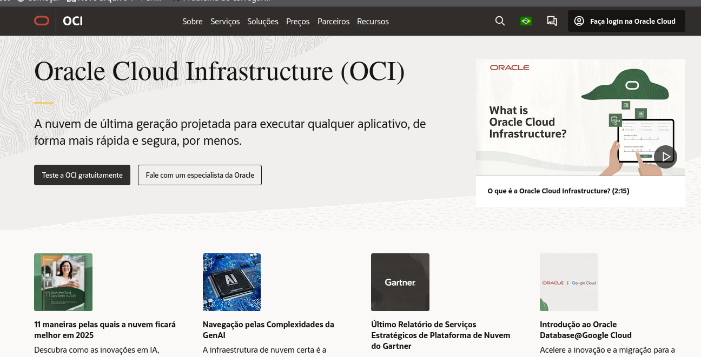

2.  **Criação da VM Ubuntu na Oracle Cloud Infrastructure (OCI)**

    #### 2.1. Criar uma virtual cloud network (VCN)
    Uma VCN é sua rede privada na OCI.

    * Acesse o console da OCI e navegue para **Rede > Redes virtuais na nuvem**;
    * Selecione o **Compartimento** (compartimento) desejado.
    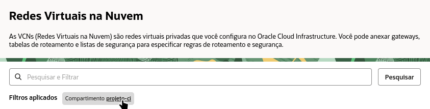
    * Clique em **Criar VCN**;
    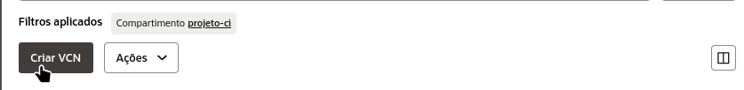
    * **Nome:** Dê um nome significativo (ex: `zabbix-vcn`);
    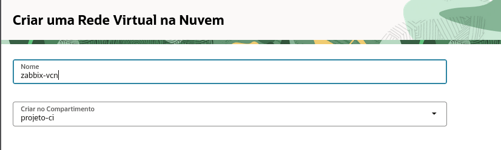
    * **Blocos CIDR IPv4:** Mantenha o padrão `10.0.0.0/24` ou defina um de sua preferência;
    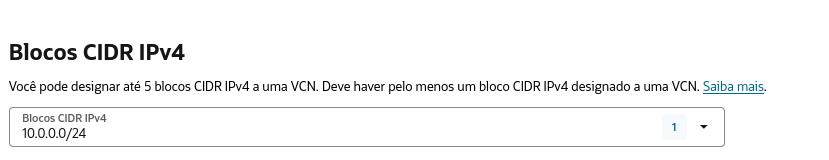
    * Marque a opção **Usar nomes de host de DNS nesta VCN**;
    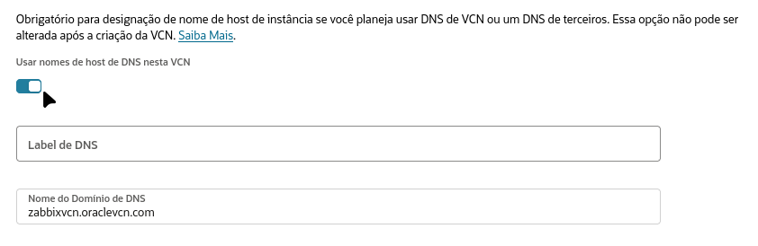
    * Clique em **Criar VCN**.
    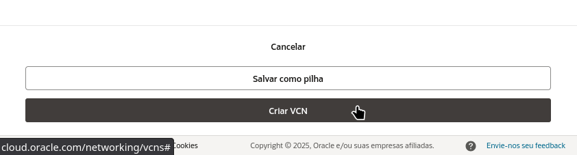

    #### 2.2. Criar uma subnet
    Uma subnet é uma sub-rede privada dentro da VCN.

    * Acesse o console da OCI e navegue para **Rede > Redes virtuais na nuvem**;
    * Selecione a VCN criada anteriormente (`zabbix-vcn`);
    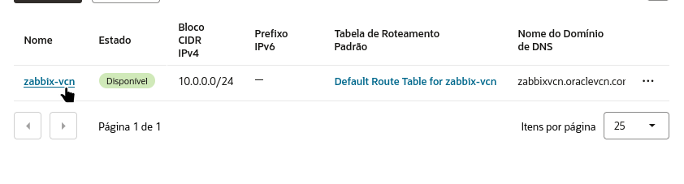
    * Clique em **Sub-redes**;
    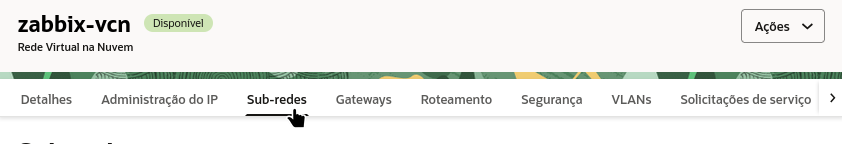
    * Clique em **Criar Sub-rede**;
    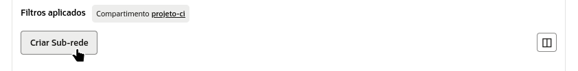
    * **Nome:** Dê um nome significativo (ex: `zabbix-vcn-subnet`);
    * **Blocos CIDR IPv4:** Mantenha o padrão `10.0.0.0/24` ou defina um de sua preferência;
    * Clique em **Criar Sub-rede**.
    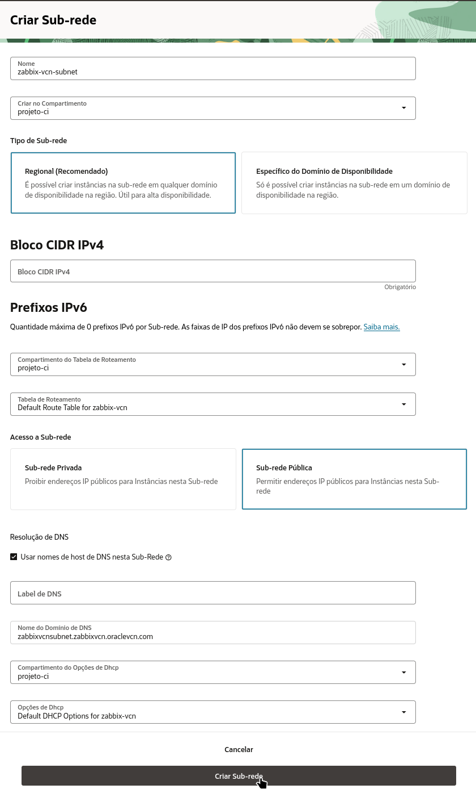

    #### 2.3. Gerar Chaves SSH
    As chaves SSH são essenciais para a conexão segura com a VM.

    * Abra um terminal (Linux/macOS) ou Git Bash/WSL (Windows);
    * Execute o comando para gerar o par de chaves;
        ```bash
        ssh-keygen -t rsa -b 2048 -f ~/.ssh/zabbix_key
        ```
    ***Obs:** O arquivo `~/.ssh/zabbix_key` contém a chave privada. Caso queira salvar o par de chaves em um outro diretório, basta alterar o path (`~/.ssh/`) da chave privada no comando acima.
    * Copie o conteúdo da sua chave pública. Você a usará na criação da VM.
        ```bash
        cat ~/.ssh/zabbix_key.pub
        ```

    #### 2.3. Lançar a Instância de Computação (VM)

    * No menu da OCI, vá para **Computação > Instâncias** e clique em **Ciar instância**;
    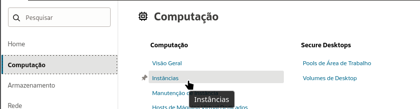
    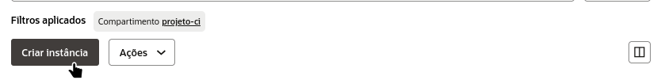
    * **Nome:** Dê um nome à sua VM (ex: `zabbix-vm`);
    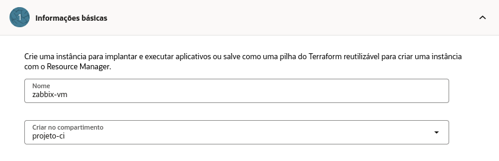
    * **Imagem e forma:**
        * **Imagem:** Clique em **Alterar Imagem**;
        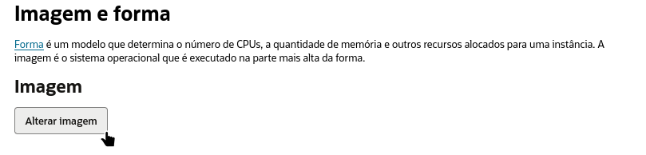
        * Selecione **Canonical Ubuntu** e a versão desejada (ex: `24.04 LTS`);
        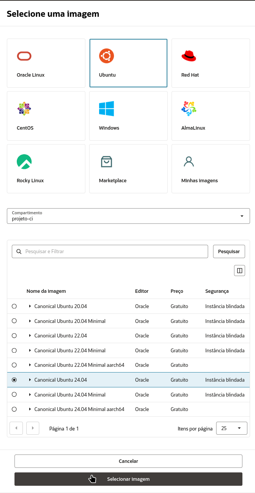
        * **Forma:** Clique em **Alterar Forma** e escolha uma forma adequada (ex: `VM.Standard.E2.2`).
        
        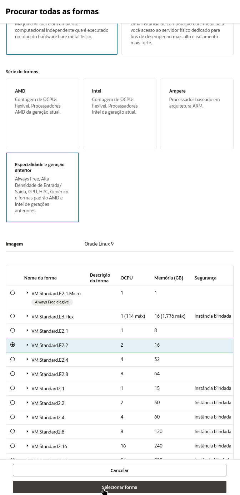
    * **Rede:**
        * **Rede virtual na nuvem:** Selecione a VCN criada anteriormente (`zabbix-vcn`);
        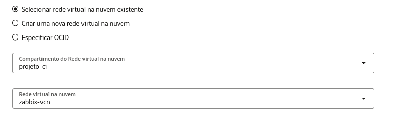
        * **Sub-rede:** Escolha a sub-rede pública;
        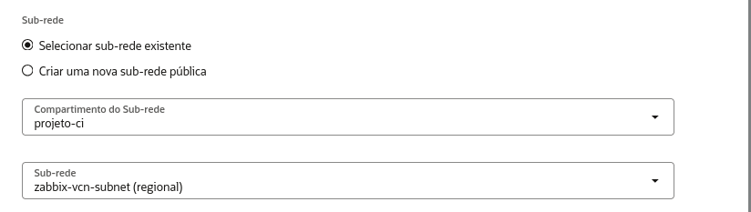
        * **Endereço de IP público:** Marque **Marque: designar endereço IPv4 público automaticamente**;
        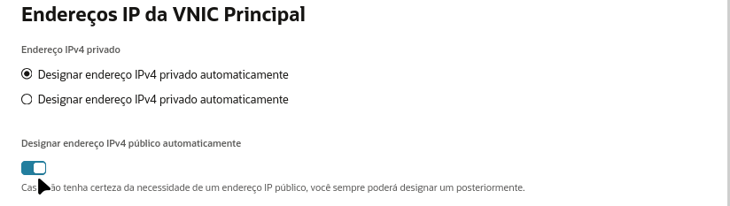
    * **Adicionar chaves SSH:** Selecione **Colar chave pública** e cole o conteúdo da sua chave pública (`~/.ssh/zabbix_key.pub`);
    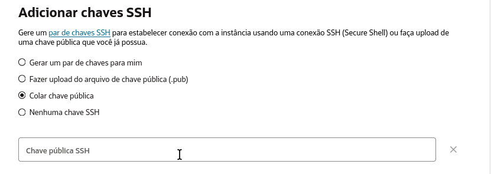
    * **Armazenamento:** Para o projeto não há necessidade de alterar o armazenamento da VM o padrão `50` GB será suficiente;
    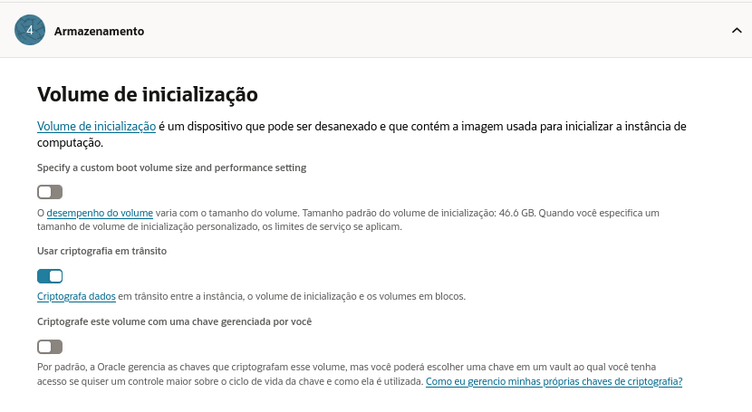
    * Clique em **Próximo** e depois em **Criar**;
    * Aguarde a instância ficar com o status "Executando" e anote o **Endereço de IP público**.

    #### 2.4. Configurar Regras de Segurança (Firewall da OCI)
    Abra as portas necessárias para a comunicação.

    * Navegue até os detalhes da sua instância e clique em **Rede**, depois em **Sub-rede** clique no nome da sua sub-rede (`zabbix-vcn-subnet`);
    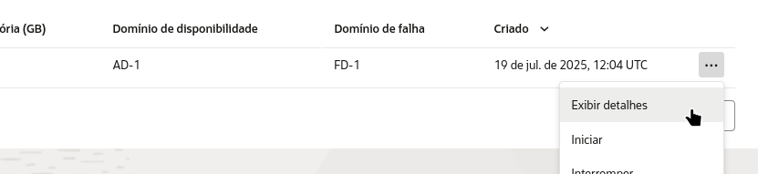
    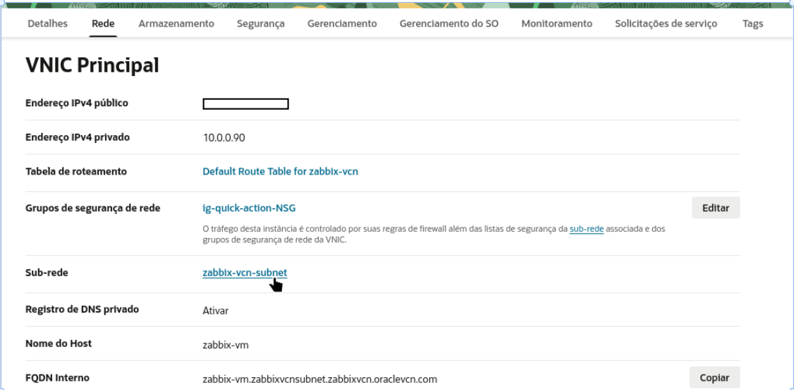
    * Clique em **Segurança**;
    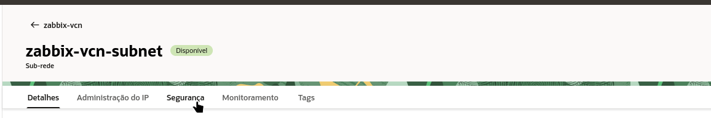

    * Clique na **Default Security List** e depois em **Regras de segurança**;
    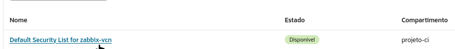
    
    * Clique em **Adicionar regras de segurança** e adicione as seguintes regras de entrada:
    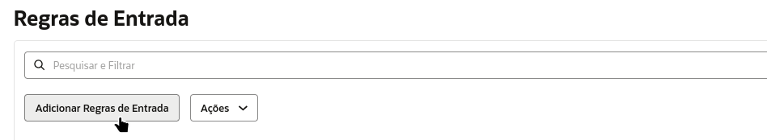
        * **Regra para SSH (Porta 22):**
            * **CIDR de origem:** `0.0.0.0/0`
            * **Protocolo IP:** `TCP`
            * **Intervalo de portas de destino:** `22`
        * **Regra para Zabbix Agent (Porta 10050):**
            * **CIDR de origem:** `0.0.0.0/0` (ou o IP do seu Zabbix Server para mais segurança)
            * **Protocolo IP:** `TCP`
            * **Intervalo de portas de destino:** `10050`
        * **Regras para Zabbix Web (Portas 8080/8443):**
            * **CIDR de origem:** `0.0.0.0/0`
            * **Protocolo IP:** `TCP`
            * **Intervalo de portas de destino:** `8080` (HTTP) e/ou `8443` (HTTPS)
            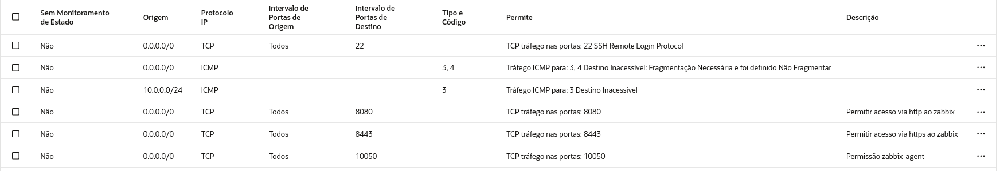

    #### 2.5. Conectar-se à VM via SSH

    * No seu terminal, ajuste as permissões da chave privada:
        ```bash
        chmod 400 ~/.ssh/zabbix_key
        ```
        * **Obs:** O arquivo `~/.ssh/zabbix_key` contém a chave privada o comando acima altera as permissões para 400, ou seja, apenas o proprietário da chave tem permissoes de leitura.
    * Conecte-se usando o IP público da sua VM:
        ```bash
        ssh -i ~/.ssh/zabbix_key ubuntu@<SEU_IP_PUBLICO_DA_VM>
        ```

3.  **Instalação e Configuração do Zabbix Agent no Host Linux**

    #### 3.1. Instalar o Zabbix Agent

    * Acesse sua VM via SSH;
    
    * Baixe e instale o pacote de repositório do Zabbix. Ajuste a URL para a versão compatível com seu Zabbix Server;
        ```bash
        wget https://repo.zabbix.com/zabbix/7.2/release/ubuntu/pool/main/z/zabbix-release/zabbix-release_latest_7.2+ubuntu24.04_all.deb

        dpkg -i zabbix-release_latest_7.2+ubuntu24.04_all.deb
        ```
    * Atualize o cache e instale o agente:
        ```bash
        sudo apt update
        sudo apt install zabbix-agent
        ```
    * Verifique se o serviço está ativo:
        ```bash
        sudo systemctl status zabbix-agent
        ```
        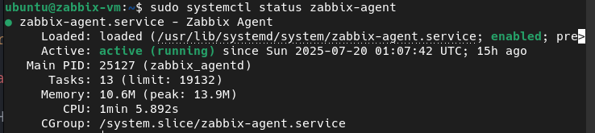
    #### 3.2. Configurar o Zabbix Agent

    * Edite o arquivo de configuração:
        ```bash
        sudo nano /etc/zabbix/zabbix_agentd.conf
        ```
    * Modifique as seguintes linhas:
        * `Server`: IP do seu Zabbix Server. Se o server estiver na mesma VM, pode usar o IP público dela.
        * `ServerActive`: IP e porta do seu Zabbix Server para checagens ativas (ex: `<IP publico da VM>:10051`).
        * `Hostname`: Nome único para o host. **Deve ser idêntico** ao que será cadastrado no Zabbix Frontend.
        * **Obs:** O copie o hostname para o campo do Zabbix Frontend.
    * Salve o arquivo (ctrl + o, Enter, ctrl + x), reinicie e verifique o status do serviço:
        ```bash
        sudo systemctl restart zabbix-agent
        sudo systemctl status zabbix-agent
        ```

    #### 3.3. Configurar o firewall interno do host (iptables)
    * **Obs:** Primeiro adicione o host ao zabbix frontend e analise se os dados estão sendo enviados, caso não, verifique se existe alguma regra de firewall bloqueando a porta 10050.
    Na instancia padrão do Ubuntu server da Oracle Cloud Infrastructure (OCI), precisei alterar o firewall para permitir a porta 10050.
    * Rode o comando para analizar a tabela de Input do Firewall: 
        ```bash
        sudo iptables -L -n
        ```

    * Adicione uma regra para permitir conexões na porta 10050:
        ```bash
        sudo iptables -I INPUT 5 -p tcp --dport 10050 -j ACCEPT
        ```
    * **Obs:** O `5` indica que a regra deve ser inserida na quinta posição da cadeia de regras.
    Adicione a regra antes do reject para permitir o trafego por essa porta, é importante inserir antes da linha reject pois o iptables lé as regras na ordem em que estão inseridas na tabela.

    * Verifique se a regra foi adicionada corretamente:
        ```bash
        sudo iptables -L -n
        ```
        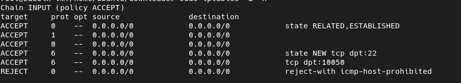
    
    * Instale o `netfilter-persistent` para salvar a regra após reinicializações:
        ```bash
        sudo apt install netfilter-persistent
        sudo netfilter-persistent save
        ```
4.  **Instalação e Configuração do Docker e Docker Compose**

    ### 4.1.Instale docker e docker compose:
    ### 4.2. Documentação docker e docker compose: 
    * Na documentação oficial consta o passo a passo para instalação do docker e docker compose nos principais sistemas operacionais; (https://docs.docker.com/desktop/)
    * Certifique-se de que ambos estejam devidamente instalados no seu sistema operacional.

        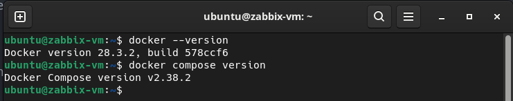
---

## Iniciando o projeto (com Docker)

1.  **Clone o repositório:**
    ```bash
    git clone [https://github.com/mizaelZuza/zabbix-monitoramento.git](https://github.com/mizaelZuza/zabbix-monitoramento.git)
    cd zabbix-monitoramento
    ```

2.  **Crie e configure o arquivo `.env`:** Este arquivo guarda suas variáveis de ambiente. Crie-o na raiz do projeto.
    ```
    MYSQL_DATABASE=(nome do database)
    MYSQL_USER=(nome do usuário)
    MYSQL_PASSWORD=(senha do usuario do banco)
    MYSQL_ROOT_PASSWORD=(senha root do banco)
    ZABBIX_SERVER_PORT=10051
    ZABBIX_WEB_HTTP_PORT=8080
    ZABBIX_WEB_HTTPS_PORT=8443
    ```
    **Obs:** Caso queira utilizar outras portas, altere o arquivo `.env` inserindo as portas desejadas.
    
    **Importante:** Adicione `.env` ao seu arquivo `.gitignore` para proteger suas credenciais.

3.  **Inicie os contêineres:**
    ```bash
    docker compose up -d
    ```

4.  **Acesse o Zabbix:** Abra o navegador e acesse a interface web na porta definida:
    * **HTTP:** `http://<ip publico da VM>:8080` (ou a porta que você configurou).

5.  **Faça login:**
    * **Usuário:** `Admin`
    * **Senha:** `zabbix`
    * **Recomendação:** Altere a senha padrão imediatamente.

---

### Gerenciando os contêineres (parar | pausar)

No diretório do projeto, utilize os seguintes comandos:

1.  **Parar e remover (permanente):**
    ```bash
    docker compose down
    ```
2.  **Parar e remover tudo (limpeza completa, incluindo volumes de dados):**
    ```bash
    docker compose down -v
    ```
3.  **Pausar contêineres:**
    ```bash
    docker compose pause
    ```
4.  **Retomar contêineres pausados:**
    ```bash
    docker compose unpause
    ```

---

### 📝 Notas do projeto

* Este projeto utiliza **Zabbix com MySQL** para garantir robustez e performance;
* A estrutura dos serviços está definida no arquivo `docker-compose.yml`;
* É utilizado volumes para armazenar os dados e configurações do Zabbix;
* O arquivo `zabbix-mysql.cnf` contém otimizações para o MySQL;
* O arquivo `data/hosts.yaml` contém exemplos para monitorar Google, CloudFlare e GitHub;
* Estamos utilizando uma VM Ubuntu na Oracle Cloud Infrastructure (OCI) para simular um ambiente real.

---

### 📊 Configuração inicial de monitoramento

Para um início rápido, importe os hosts de exemplo e crie um dashboard.

#### 1. Importar hosts de exemplo

* O arquivo `data/exemplo-hosts.yaml` contém exemplos para monitorar Google, CloudFlare e GitHub.

* **Para importar:**
1.  No menu do Zabbix, vá para **Coleção de dados > Servidores**;
        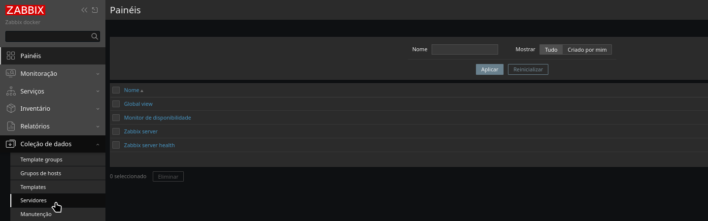

2.  Clique no botão **Importar** no canto superior direito;
        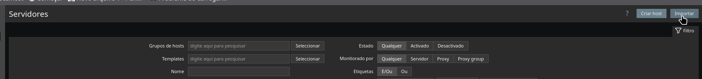

3.  Clique em procurar e seleccione o arquivo `data/exemplo-hosts.yaml`;

4.  Clique em **Importar**.
        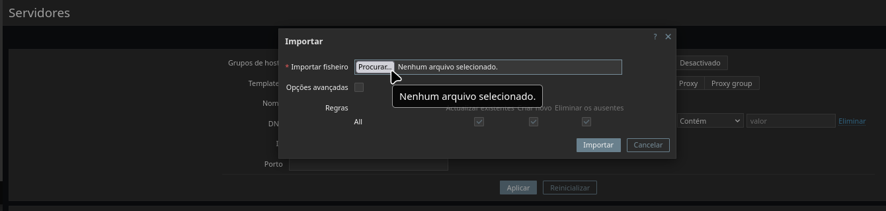

#### 2 Criar um host no Zabbix frontend
**Obs:** No exemplo criaremos um host para monitorar uma vm Unbuntu no oracle cloud.

* Acesse sua interface web do Zabbix;
* Vá para **Coleção de dados > Servidores** e clique em **Criar host**;
    
    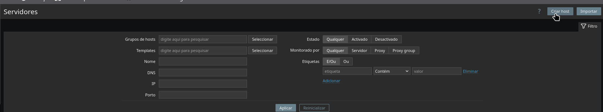
* Preencha os campos:
    * **Nome do host:** Digite o nome **exato** configurado no `zabbix_agentd.conf`.
    * **Grupos de hosts:** Associe a um grupo (ex: `Linux servers`).
    * **Interfaces:** Adicione uma interface do tipo **Zabbix agent**, preenchendo o **IP address** público da VM e a porta `10050`.
* Na aba **Templates**, vincule um modelo apropriado, como `Linux by Zabbix agent`.
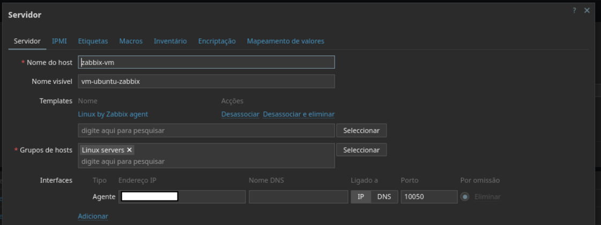
* Clique em **Adicionar** para salvar.
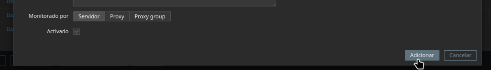

#### 2.1. Verificar a Coleta de Dados

* Aguarde alguns minutos;
* Vá para **Monitoração > Dados recentes**;
* Filtre pelo host recém-criado para ver os dados sendo coletados. O ícone de disponibilidade do host em **Monitoração > Servidores** deve ficar verde.
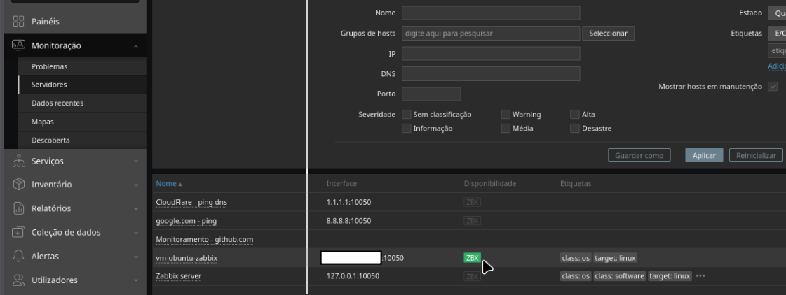
---

#### 3. Criar um dashboard básico

1.  No menu, clique em **Painéis**;
    
2.  Clique em **Criar novo**;
    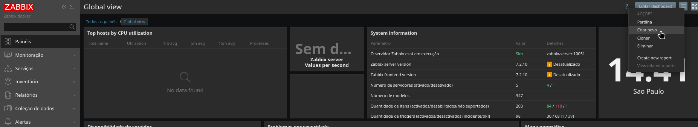
3.  Dê um nome ao dashboard e clique em **Aplicar**;
    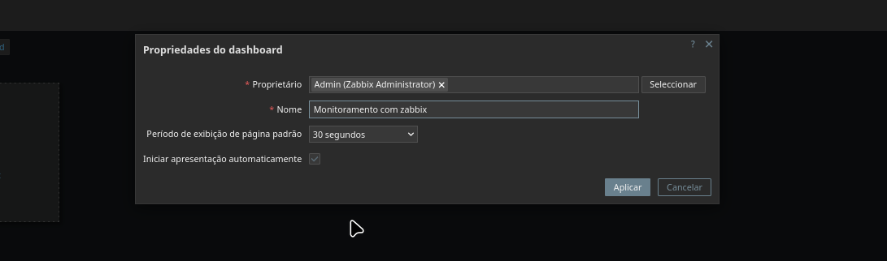
4.  Clique em uma área vazia para adicionar um widget (ex: um `Gráfico`) para visualizar os dados dos seus hosts;
5.  Clique em **Adicionar** e preencha:
    * **Nome:** Nome do widget
    * **Host patterns:** Hosts a serem monitorados
    * **Items patterns:** Items a serem monitorados
    * **Aspectos do grafico:** Opções de estilo do gráfico (cor, largura, tipo, posição, etc.)
    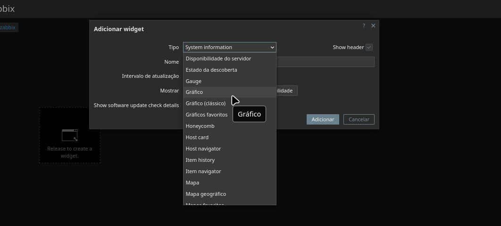
    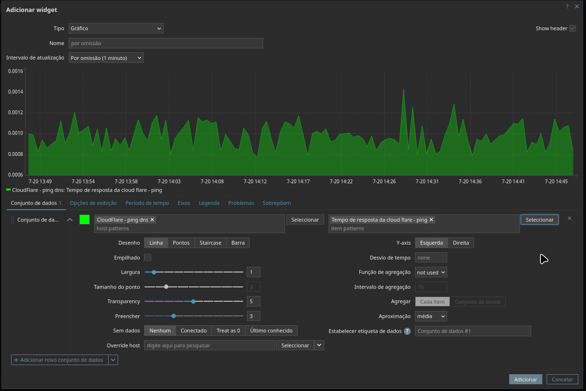