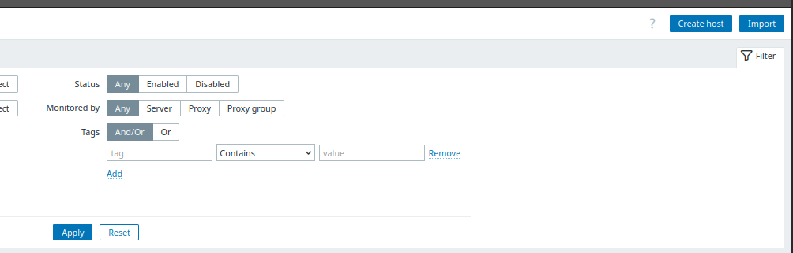

---

## Projeto: Monitoramento de infraestrutura com Zabbix

Este projeto oferece uma solução robusta e escalável para **monitoramento de infraestrutura**, utilizando o poder do Zabbix, um software de código aberto líder em monitoramento de rede e sistemas. Desenvolvido para flexibilidade, ele se adapta facilmente a diversos ambientes, garantindo que você tenha visibilidade total sobre a saúde e performance dos seus sistemas.
O projeto visa a criação de um ambiente completo rodando localmente via docker e docker compose para facilitar a execução, configuração e gerenciamento dos serviços do Zabbix.

---

### 💻 Tecnologias envolvidas

* **Zabbix (`alpine-7.2-latest`):** A plataforma central de monitoramento;
* **MySQL (8.0):** Serve como o backbone de banco de dados, escolhido pela sua estabilidade e compatibilidade otimizada com o Zabbix;
* **Docker:** Para orquestração eficiente e isolamento dos serviços, garantindo um ambiente consistente e fácil de gerenciar;
* **YAML:** Utilizado para a configuração intuitiva e legível dos serviços via Docker Compose.

---

### ⚙️ Configurações essenciais

Para colocar o projeto em funcionamento, siga estas etapas simples de configuração:

1.  **Instale docker e docker compose:** Certifique-se de que ambos estejam devidamente instalados no seu sistema operacional;
2.  **Documentação docker e docker compose:** Na documentação oficial consta o passo a passo para instalação do docker e docker compose nos principais sistemas operacionais. (https://docs.docker.com/desktop/)


---

## Iniciando o projeto

Para colocar seu monitoramento em funcionamento, siga estas etapas:

1.  **Clone o repositório:** Baixe o código do projeto para o seu ambiente local;
    ```bash
    git clone https://github.com/mizaelZuza/zabbix-monitoramento.git
    cd zabbix-monitoramento
    ```

2.  **Crie e configure o arquivo `.env`:** Este arquivo, localizado no diretório raiz do projeto (o mesmo para onde você navegou no passo anterior, `zabbix-monitoramento`), abrigará suas **variáveis de ambiente sensíveis**. **É crucial que esse arquivo seja criado antes de iniciar os contêineres;**

    Crie um arquivo chamado `.env` e adicione as seguintes variáveis, substituindo os valores entre parênteses pelos seus próprios:
    ```
    MYSQL_DATABASE=(nome do database)
    MYSQL_USER=(nome do usuário)
    MYSQL_PASSWORD=(senha do usuario do banco)
    MYSQL_ROOT_PASSWORD=(senha root do banco)
    ZABBIX_SERVER_PORT=10051
    ZABBIX_WEB_HTTP_PORT=8080
    ZABBIX_WEB_HTTPS_PORT=8443
    ```
    **Proteja suas credenciais:** Adicione `.env` ao seu arquivo `.gitignore` para prevenir que suas credenciais sejam acidentalmente versionadas em repositórios públicos.

3.  **Inicie os contêineres:** No diretório do projeto (`zabbix-monitoramento`), execute o comando para iniciar todos os serviços em segundo plano:
    ```bash
    docker compose up -d
    ```

4.  **Acesse o Zabbix:** Uma vez que os contêineres estejam em execução, você pode acessar a interface web do Zabbix utilizando a porta que você definiu em `ZABBIX_WEB_HTTP_PORT` (por padrão, `8080`) ou `ZABBIX_WEB_HTTPS_PORT` (se configurado, por padrão `8443`):
    * **HTTP:** `http://localhost:${ZABBIX_WEB_HTTP_PORT}` (ex: `http://localhost:8080`)
    * **HTTPS:** `https://localhost:${ZABBIX_WEB_HTTPS_PORT}` (ex: `https://localhost:8443`)

5.  **Faça login:** Utilize as credenciais padrão para seu primeiro acesso:
    * **Usuário:** `Admin`
    * **Senha:** `zabbix`
    * **Recomendação:** Altere a senha padrão imediatamente após o primeiro login para garantir a segurança.

6.  **Configure seu monitoramento:** O Zabbix estará pronto para você adicionar hosts, templates e configurar suas necessidades específicas de monitoramento.

---

### Gerenciando os contêineres (parar | pausar)

No diretório do projeto, utilize os seguintes comandos para gerenciar seus contêineres:

1.  **Parar e remover (permanente):** Este comando para e remove os contêineres. Se você não usar `-v`, os volumes de dados (como o do MySQL) persistirão;
    ```bash
    docker compose down
    ```
2.  **Parar e remover tudo (limpeza completa):** Este comando para e remove os contêineres **e todos os volumes de dados** associados ao projeto (incluindo dados do MySQL);
    ```bash
    docker compose down -v
    ```
3.  **Pausar contêineres:** Suspende temporariamente a execução dos contêineres, mantendo seu estado na memória;
    ```bash
    docker compose pause
    ```
4.  **Retomar contêineres pausados:** Reinicia a execução dos contêineres previamente pausados.
    ```bash
    docker compose unpause
    ```

---

### 📝 Notas do projeto

* Este projeto foi arquitetado utilizando **Zabbix com MySQL** como backend de banco de dados para robustez e performance.
* A estrutura dos contêineres e seus serviços é definida no arquivo **`docker-compose.yml`**, oferecendo uma visão clara da sua stack de monitoramento.
* O arquivo **`zabbix-mysql.cnf`** contém configurações específicas do MySQL para otimizar sua performance com o Zabbix (charset, collation, etc.).

---

### 📊 Configuração inicial de monitoramento

Para iniciar rapidamente o monitoramento, você pode importar hosts de exemplo e criar um dashboard básico:

#### 1. Importar hosts de exemplo

* Na pasta `data`, você encontrará um arquivo **`exemplo-hosts.yaml`** com configurações para monitorar o Google, CloudFlare e GitHub.
* Importe esses hosts no Zabbix:

    1.  No menu esquerdo, vá para **Data collection** e clique em **Hosts**;

        
            
    2.  No canto superior direito, clique no botão **`Import`**;

        

    3.  Selecione o arquivo `./data/exemplo-hosts.yaml` e siga as instruções;
    4.  Após a importação, os três hosts estarão configurados e prontos para serem monitorados.

        

#### 2. Criar um dashboard básico

Crie um dashboard para visualizar os dados coletados:

1.  No menu esquerdo, clique em **`Dashboards`**;

    

2.  No canto superior direito, clique em **`Create Dashboard`**;

    

3.  Defina o **proprietário (`Owner`)** do dashboard (geralmente seu próprio usuário) e dê um **nome (`Name`)** para ele. Por fim clique em **Apply**;

    

4.  Após criar o dashboard, clique em uma área vazia para adicionar um widget:
    * Escolha o **tipo (`Type`)** de widget desejado (por exemplo, `Graph` para gráficos);
    * Dê um **nome (`Name`)** ao componente;
    * Defina um **intervalo de atualização (`Refresh Interval`)**;
    * Em **parâmetros do host (`Host Params`)**, selecione o host e o item que deseja monitorar;
    * Em **parâmetros do item (`Item Params`)**, configure a representação visual (cor, formato, etc.);
    * Por fim, clique em **`Add`**.

    

---