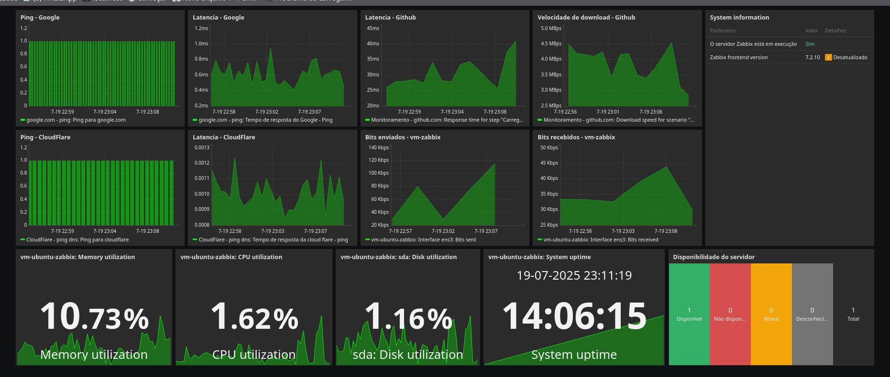
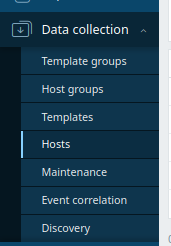
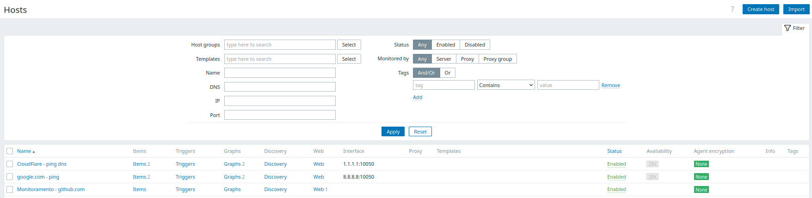
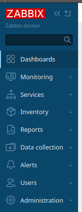
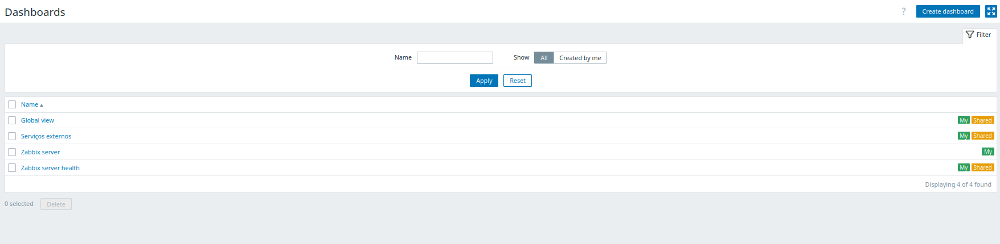
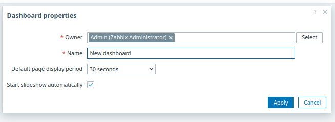
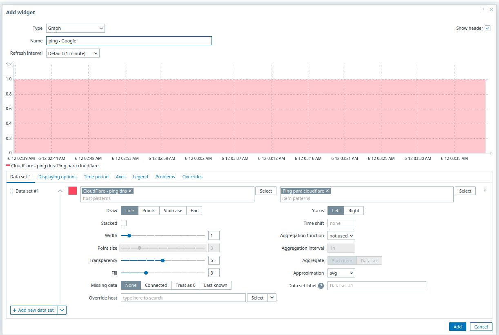

---

## 🚀 Projeto: Monitoramento de Infraestrutura com Zabbix

Este projeto oferece uma solução robusta e escalável para **monitoramento de infraestrutura**, utilizando o poder do Zabbix, um software de código aberto líder em monitoramento de rede e sistemas. Desenvolvido para flexibilidade, ele se adapta facilmente a diversos ambientes, garantindo que você tenha visibilidade total sobre a saúde e performance dos seus sistemas.

---

### 💻 Tecnologias envolvidas

* **Zabbix (latest):** A plataforma central de monitoramento, utilizar a tag `latest` garante que você utilize os recursos mais recentes.
* **MySQL (8.0):** Serve como o backbone de banco de dados, escolhido pela sua estabilidade e compatibilidade otimizada com o Zabbix.
* **Docker:** Para orquestração eficiente e isolamento dos serviços, garante um ambiente consistente e fácil de gerenciar.
* **YAML:** Utilizado para a configuração intuitiva e legível dos serviços via Docker Compose.

---

### ⚙️ Configurações essenciaiso menu Data Collection

Para colocar o projeto em funcionamento, siga estas etapas simples de configuração:

1.  **Instale Docker e Docker Compose:** Certifique-se de que ambos estejam devidamente instalados no seu sistema operacional.
2.  **Crie o arquivo `.env`:** Este arquivo, localizado no diretório raiz do projeto, abrigará suas variáveis de ambiente sensíveis. Adicione as seguintes variáveis:
    * `MYSQL_DATABASE`
    * `MYSQL_USER`
    * `MYSQL_PASSWORD`
    * `MYSQL_ROOT_PASSWORD`
    * `ZABBIX_SERVER_PORT_EXTERNAL` (Ex: `10051`)
    * `ZABBIX_WEB_HTTP_PORT_EXTERNAL` (Ex: `8080`)
    * `ZABBIX_WEB_HTTPS_PORT_EXTERNAL` (Ex: `8443` - Se você habilitar HTTPS no Nginx do Zabbix Web)
3.  **Proteja suas Credenciais:** Adicione `.env` ao seu arquivo `.gitignore` para prevenir que suas credenciais sejam acidentalmente versionadas em repositórios.

---

### 🚀 Iniciando o projeto

Com as configurações prontas, subir sua stack de monitoramento é rápido:

1.  **Clone o Repositório:** Baixe o código do projeto para o seu ambiente local.
    ```bash
    git clone https://github.com/mizaelZuza/Esteira-DevOps.git
    ```
    ```bash
    cd <nome_do_diretorio>
    ```
2.  **Inicie os contêineres:** No diretório do projeto, execute o comando para iniciar todos os serviços em segundo plano:
    ```bash
    docker compose up -d
    ```
3.  **Acesse o Zabbix:** Uma vez que os contêineres estejam em pé, você pode acessar a interface web do Zabbix.
    * **HTTP:** `http://localhost:8080` (caso tenha alterada a porta padrão, `http://localhost:PORTA_ALTERADA`)
    * **HTTPS:** `https://localhost:8443` (caso tenha alterada a porta padrão, `https://localhost:PORTA_ALTERADA`)
4.  **Faça Login:** Utilize as credenciais padrão para seu primeiro acesso:
    * **Usuário:** `Admin`
    * **Senha:** `zabbix`
    * **Recomendação:** Altere a senha padrão imediatamente após o primeiro login para garantir a segurança.
5.  **Configure seu Monitoramento:** O Zabbix estará pronto para você adicionar hosts, templates e configurar suas necessidades específicas de monitoramento.

---

### 🚀 Parando | Pausando o projeto
1.  **Parar os contêineres:** No diretório do projeto, execute o comando para parar e remover os containers.
    ```bash
    docker compose down
    ```
2. **Parar os contêineres e remover os volumes:** No diretório do projeto, execute o comando para parar e remover os contêiners e volumes.
    ```bash
    docker compose down -v
    ```
3.  **Pausar os contêineres:** No diretório do projeto, execute o comando para pausar os contêineres.
    ```basho menu Data Collection
    docker compose pause
    ```
---

### ℹ️ Observações importantes

* Este projeto foi arquitetado utilizando **Zabbix com MySQL** como backend de banco de dados para robustez e performance.
* A estrutura dos contêineres e seus serviços é definida no arquivo **`docker-compose.yml`**, oferecendo uma visão clara da sua stack de monitoramento.
* O arquivo **`my.cnf`** (ou `zabbix-mysql.cnf`, dependendo de como você o nomeou) contém configurações específicas do MySQL para otimizar sua performance com o Zabbix.

---

### ℹ️ Observações complementares

* Na pasta data disponibilizei um arquivo **.yaml** com 3 hosts configurados (Google, CloudFlare e Github).
* Pode utilizar esse arquivo como ponto de partida para testes de monitoramento. 
 ---
 ### Para utilização

 * Importe os hosts dosponibilizados no arquivo **./data/exemplo-hosts.yaml**

1. Clique em **Data collection** e clique em **Hosts**

 

2. No canto superior direito, clique em **Import**

 

3. Os três hosts estarão configurados

 

* Crie um dashboard para visualização dos dados coletados.

1. Clique no menú **Dashboards**

 

2. No canto superior direito, clique em **Create Dashboard**

 

3. Escolha o usuário proprietário **Owner** Dê um nome para o seu Dashboard **name**.

 

4. Clique numa área vazia do dash
 - Escolha o tipo de grafico ou elemento que deseja utilizar **Type**. (Como exemplo estou utilizando o tipo gráfico.)
 - Dê um nome para o componente que está criando **Name**.
 - Selecione um tempo de atualização **Refresh Interval**.
 - Selecione o host e o item do host que deseja monitorar **Host Params**
 - Configure como o elemento representará os dados na tela **Itens Params**
   - Cor, formato, tamanho, transparencia, etc.
 - Por fim clique em **Add**

 